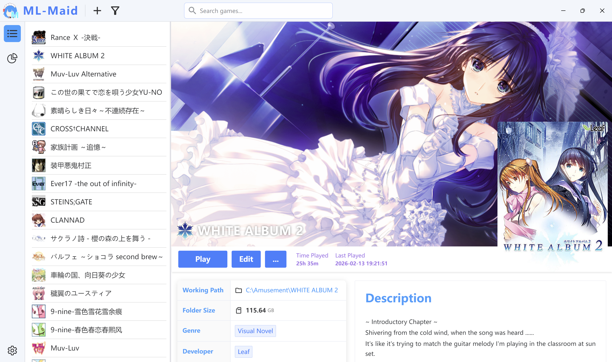
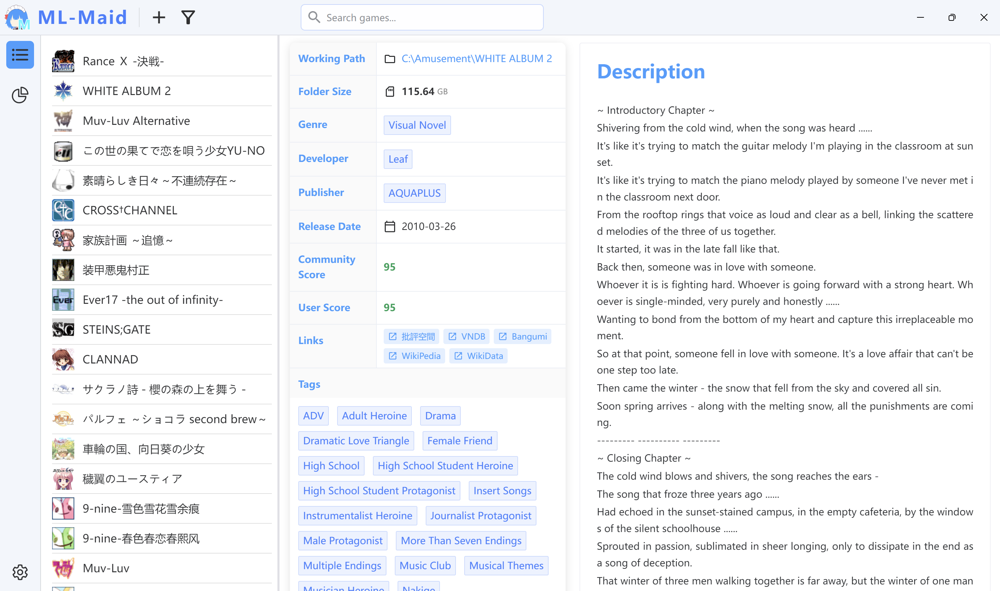
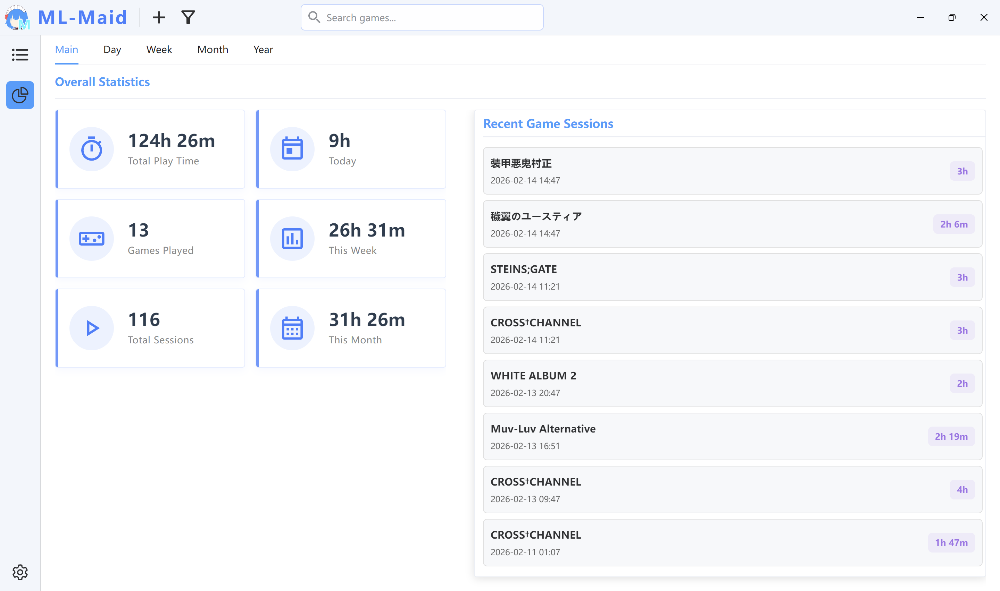
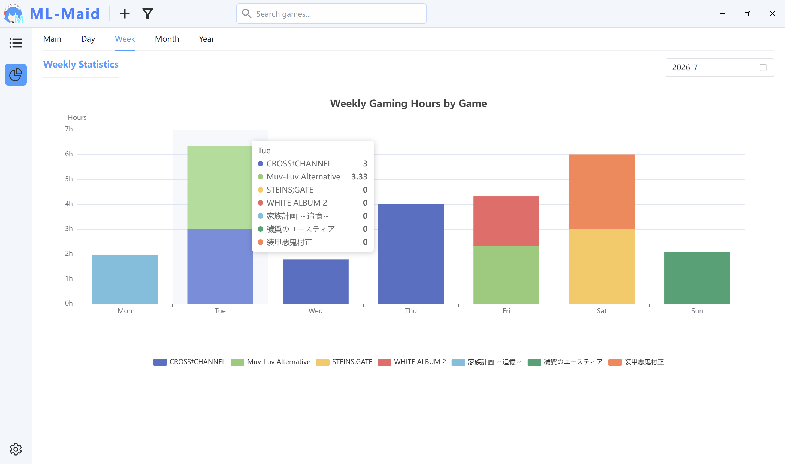
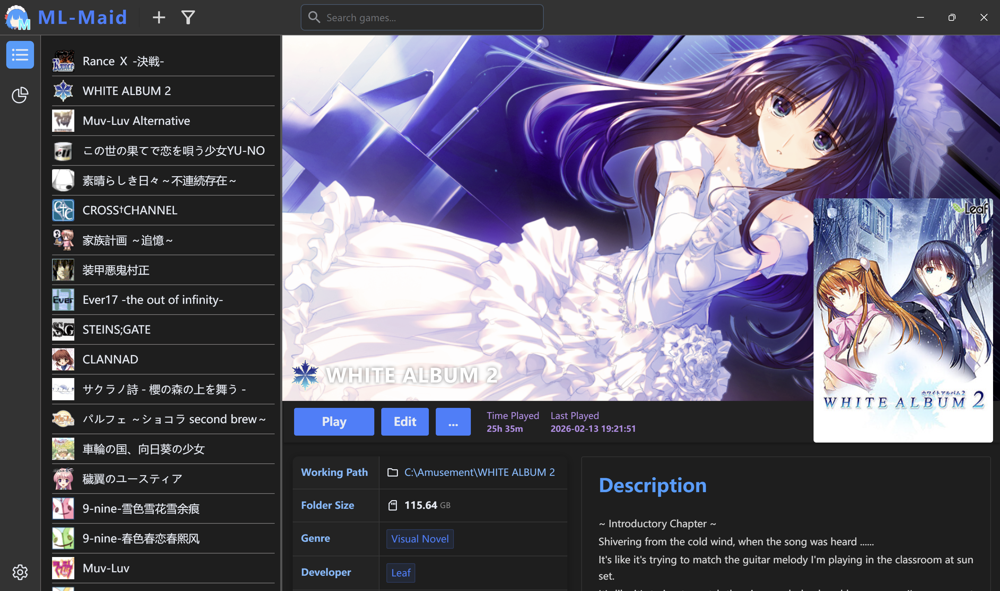
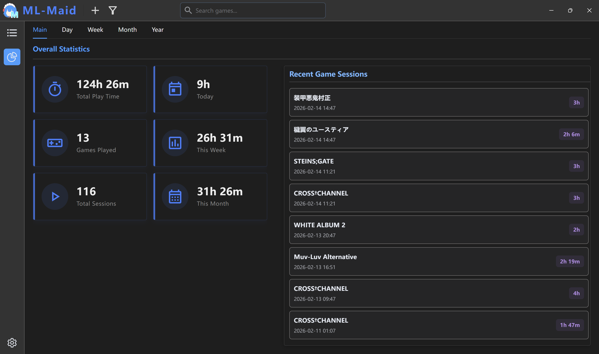
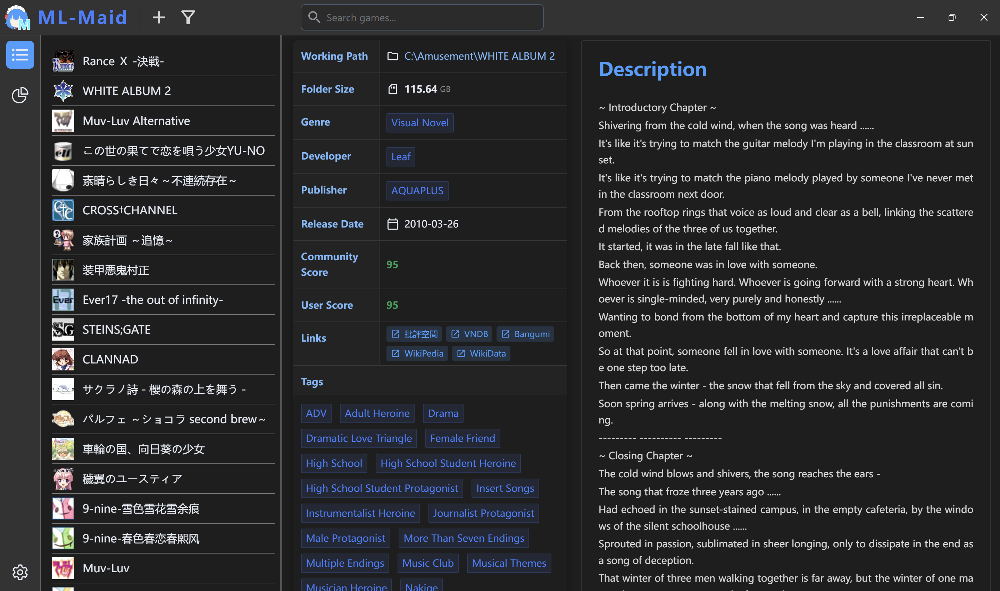
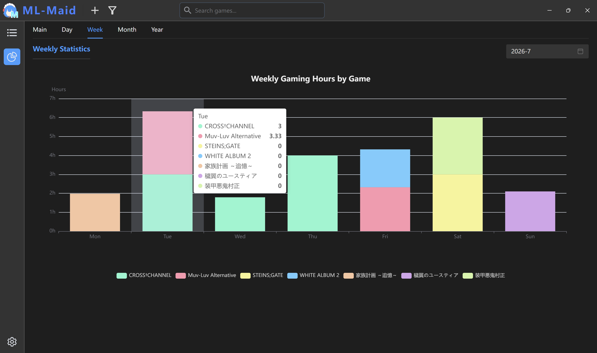

  

  <h1 align="center">
    ML-Maid
  </h1>

  

    
     
    
    
    
    
     
    
    
    
    
  

**English** | [简体中文](./docs/ReadMe/README_zh-CN.md)

A clean, simple, and bare-bones visual novel manager (for self use).

## ✨ Features

Some basic functionality is currently implemented:

- **Game library management**: Basic functions for adding, editing and deleting games, and provides a game information page that is tentatively intended to be concise and good-looking.
- **Game Launcher**: Launching games directly from within the app and tracks game progress. Supports Japanese locale-emulation launch via [Locale Emulator](https://github.com/xupefei/Locale-Emulator).
- **Game logging statistics**: Logging the time of each game process, providing multiple statistical views. Maybe a little redundant, but better to have it and not need it.

## ⬆️ Upgrading from 0.4.x (Electron)

Since v0.5.0 ML-Maid is built with Tauri 2 (WebView2 + Rust) instead of Electron:

- Your data is picked up automatically — the installed version keeps using `Documents\ML-Maid`, the portable version keeps using the folder next to the exe.
- On first launch the databases are migrated (a `*.backup.*` copy is created beside them). After that, they can no longer be opened by 0.4.x — restore the backup if you need to roll back.
- Please uninstall the old Electron version manually; the new installer does not replace it.
- Windows 10/11 x64 only. WebView2 Runtime is preinstalled on these systems.

## 📷 Screenshots

  
Light

  
  
  
  

  
Dark

  
  
  
  

## 🌏 Translation

Currently, official translations are available in English and Simplified Chinese, as well as a machine-translated Japanese version. Contributions to improve translations are welcome via Pull Requests.