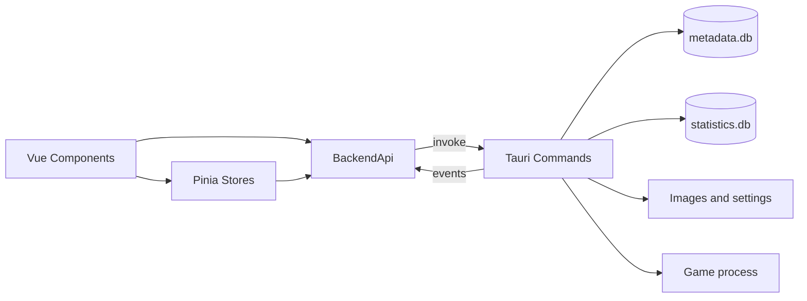

# Development and Architecture

## Stack

The frontend uses Vue 3, TypeScript, Vite, Pinia, Vue Router, Vue I18n, Naive UI, and ECharts. `unplugin-auto-import` and `unplugin-vue-components` provide generated imports. The backend uses Tauri 2, Rust 2021, bundled rusqlite, sysinfo, serde, chrono, and selected Windows APIs.

## Commands

```bash
npm install
npm run dev          # Tauri and Vite
npm run dev:front    # Vite only
npm run build:front  # vue-tsc and Vite build
npm run build        # Tauri build and artifact collection
cargo test --manifest-path src-tauri/Cargo.toml
cargo fmt --manifest-path src-tauri/Cargo.toml -- --check
```

## Data flow



`MainView.vue` switches between Library, Statistics, and Settings. `GameFormModals.vue` hosts add/edit forms. Components do not import Tauri directly: the adapter owns `invoke`, event subscriptions, dialogs, opener calls, and `convertFileSrc`.

