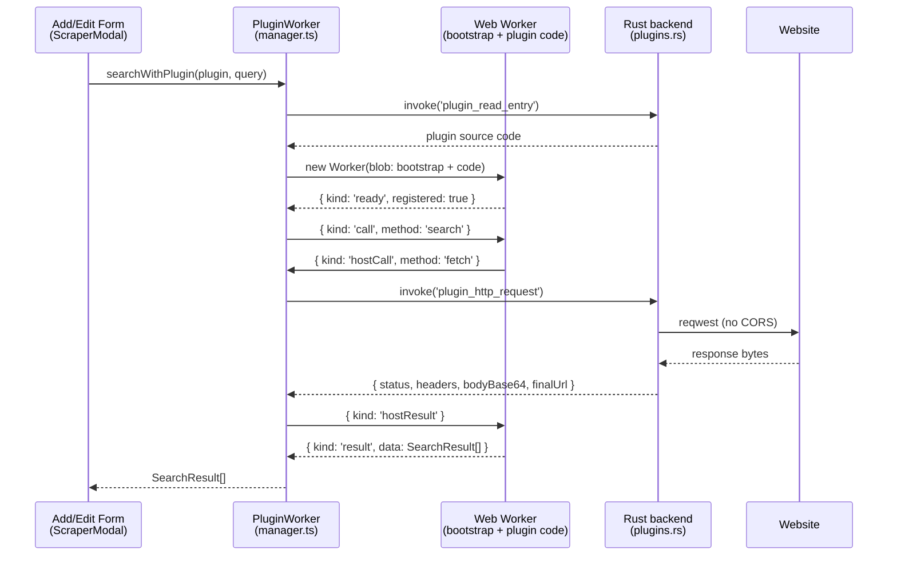

# Plugin System

ML-Maid ships a general-purpose plugin system. Version 1 supports one plugin type — `metadata-scraper` — which powers the in-form "Scrape" feature: search a website for a game, preview the metadata it returns, and apply selected fields (including cover/background artwork) to the add/edit form. The design deliberately leaves room for other plugin types in the future.

The official plugins live in a separate repository ([ML-Maid_Plugins](https://github.com/Kurosu-Ti01/ML-Maid_Plugins)); the main application bundles none. If you want to *write* a plugin, read [Plugin Development](/developer-guide/plugin-development/) — this page explains how the system itself works.

## Design goals

- **Low authoring barrier.** A plugin is a folder with a `manifest.json` and one JavaScript file. No build step, no compilation, no main-app PR. Drop it into the `plugins/` directory and refresh.
- **Any website is scrapable.** Plugin HTTP traffic is proxied through the Rust backend, so CORS never applies. Sites without a JSON API — or serving legacy Shift_JIS pages — work too.
- **Contained execution.** Plugin code runs in a Web Worker: no DOM, no Node.js, no arbitrary script loading. Its only capabilities are the ones the host injects.
- **Reuse the existing pipelines.** Downloaded artwork enters the same `temp → crop → finalize` image flow as manually picked files; scraped fields merge into the same form model.

## Anatomy

```
<data dir>/plugins/            # dev: repo root; installed: Documents\ML-Maid; portable: beside the exe
└─ vndb-scraper/
   ├─ manifest.json            # id, name, version, type, apiVersion, entry, ...
   └─ main.js                  # entry script, executed inside a Web Worker
```

The manifest's `type` and `apiVersion` gate execution: unknown types or incompatible API versions are still listed in Settings but marked unsupported and never run. This is the forward-compatibility mechanism — a future ML-Maid can introduce `type: "theme"` or `apiVersion: 2` without breaking old installs.

## Runtime architecture



### Discovery (Rust, `plugins.rs`)

`plugins_list` scans first-level subdirectories of `plugins/` and parses each `manifest.json`. A broken manifest only skips that one folder (logged to stderr), so a bad plugin cannot hide the rest. `plugin_read_entry` returns the entry script's text; both the directory name and the manifest's `entry` are validated by `is_safe_name` (no separators, no `..`, nothing hidden) to prevent path traversal.

### Worker sandbox (frontend, `src/plugins/`)

`bootstrap.ts` holds the worker-side runtime as a source string. `buildWorkerSource()` concatenates it with the plugin's code and a trailing ready-report into a single `blob:` URL, from which the Worker is created (CSP: `worker-src 'self' blob:`). The bootstrap defines the entire plugin API surface:

- `MLMaid.register({ search, getDetails })` — must be called synchronously at top level; the trailing `__mlmaidReady()` reports whether registration happened, and an unregistered or crashing plugin is destroyed immediately.
- `host.fetch(url, options)` — bridges to the backend proxy via message passing (see below).
- `host.log(...)` — fire-and-forget console logging, prefixed `[plugin:<id>]`.

`manager.ts` owns worker lifecycles in a module-level `Map` (never inside Pinia — reactive proxies must not wrap a Worker). Workers are created lazily per plugin id and reused; disabling a plugin or refreshing the list disposes them. Two timeouts protect the host: 5 s for initialization and 60 s per `search`/`getDetails` call. A timed-out worker is assumed stuck in a loop and is terminated — `Worker.terminate()` is the only way to stop runaway JavaScript.

### RPC protocol

Messages are discriminated unions on `kind`, with ids incrementing per sender so the two directions never collide:

| kind | direction | purpose |
| --- | --- | --- |
| `call` / `result` | host → worker / worker → host | invoke `search`/`getDetails`, return value or error |
| `hostCall` / `hostResult` | worker → host / host → worker | `fetch` (request/response) and `log` (no reply) |
| `ready` | worker → host | one-shot: did the plugin register? |

### HTTP proxy (Rust, `plugin_http_request`)

A shared `reqwest` client (rustls, gzip, 30 s timeout, `ML-Maid/<version>` user agent) executes GET/POST/HEAD requests on behalf of plugins. Response bodies are returned **base64-encoded, always**: many legacy VN sites serve Shift_JIS or EUC-JP, and a lossy UTF-8 conversion would destroy them. The worker-side response object exposes `bytes`, `text(encoding?)` (any `TextDecoder` label), and `json()` so the plugin picks the decoding.

Guard rails: only `http`/`https` schemes; `localhost` and loopback/private/link-local IP literals are refused; bodies are streamed and cut off at 10 MB without trusting `Content-Length`. This is deliberately *not* full SSRF hardening (no DNS-rebinding defense) — plugins are hand-installed and the trust decision happens at install time, the proxy just refuses obviously non-web targets.

### Image download (`download_game_image`)

Scraped artwork arrives as URLs; the host downloads them. The command fetches the bytes (30 MB cap), determines the format by **magic-byte sniffing** (`image::guess_format` — headers and URL extensions are not trusted, and sniffing doubles as proof the payload really is an image), clears stale same-stem files, and writes `temp/images/<uuid>/<type>.<ext>`. It returns the same shape as `process_game_image`, so the preview, crop, save-time finalize, and cancel-time cleanup flows all apply without modification.

Remote thumbnails in the scraper UI never touch `img-src`: they are fetched through the proxy and rendered as `blob:` object URLs, which the existing CSP already allows.

### Enable state

Disabled plugin ids persist in `settings.conf` under `[plugins]` as `disabled[]=<id>` lines. Storing the *disabled* list means new plugins are enabled out of the box and deleting a plugin leaves no meaningful residue. The Settings page's Plugins card lists installed plugins with version/type tags, an enable switch, refresh, and an open-folder shortcut.

## Security model

| Layer | Containment |
| --- | --- |
| Web Worker | No DOM, no Tauri APIs, no `importScripts` of remote code (CSP `script-src 'self'` applies inside blob workers) |
| Host API | The worker's only capabilities are `host.fetch` and `host.log`; everything else must go through the typed scraper contract |
| HTTP proxy | http/https only, private/loopback targets refused, 10 MB cap, GET/POST/HEAD only |
| Filesystem | Plugins never see paths; the host reads entry scripts (traversal-checked) and writes images into per-game temp slots with whitelisted names |
| Kill switch | Per-call 60 s timeout terminates stuck workers; disabling a plugin disposes its worker immediately |

The remaining trust boundary is intentional: a plugin can ask the proxy to fetch any public URL. Installing a plugin is the act of trusting its author — the same model as Obsidian or Playnite. Review a third-party plugin's `main.js` (it is plain, unminified JavaScript) before dropping it into `plugins/`.

## File map

| Area | Files |
| --- | --- |
| Backend | `src-tauri/src/plugins.rs` (commands: `plugins_list`, `plugin_read_entry`, `plugin_http_request`, `download_game_image`), `paths.rs` (`plugins_path`), `settings.rs` (`[plugins]` section) |
| Host runtime | `src/plugins/types.ts`, `bootstrap.ts`, `manager.ts`, `apply.ts` |
| State | `src/stores/plugins.ts` |
| UI | `src/components/ScraperModal.vue`, `ImageUrlDialog.vue`, plugin card in `Settings.vue`, scrape button in `GameAddForm.vue` / `GameEditForm.vue` |
| Policy | `index.html` (CSP `worker-src 'self' blob:`), `src-tauri/capabilities/default.json` (opener path scope) |
