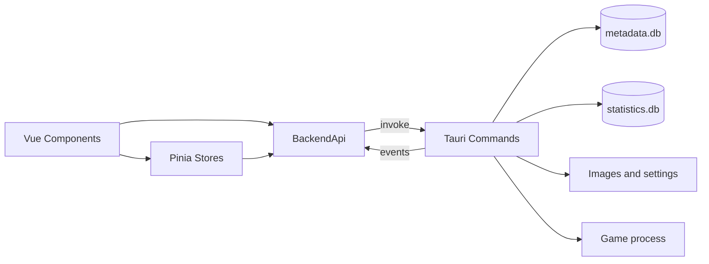

# 开发环境与架构

## 技术栈

前端使用 Vue 3、TypeScript、Vite、Pinia、Vue Router、Vue I18n、Naive UI 和 ECharts；自动导入由 `unplugin-auto-import` 与 `unplugin-vue-components` 完成。后端使用 Tauri 2、Rust 2021、rusqlite（bundled SQLite）、sysinfo、serde、chrono 和 Windows API。

## 常用命令

```bash
npm install
npm run dev          # Tauri + Vite
npm run dev:front    # 仅 Vite
npm run build:front  # vue-tsc + Vite build
npm run build        # Tauri build + 收集发布产物
cargo test --manifest-path src-tauri/Cargo.toml
cargo fmt --manifest-path src-tauri/Cargo.toml -- --check
```

## 数据流



`MainView.vue` 在游戏库、统计和设置页面之间切换。`GameFormModals.vue` 承载添加/编辑弹窗。组件不直接导入 Tauri API；适配器负责 `invoke`、事件订阅、文件选择、外部打开和 `convertFileSrc`。

