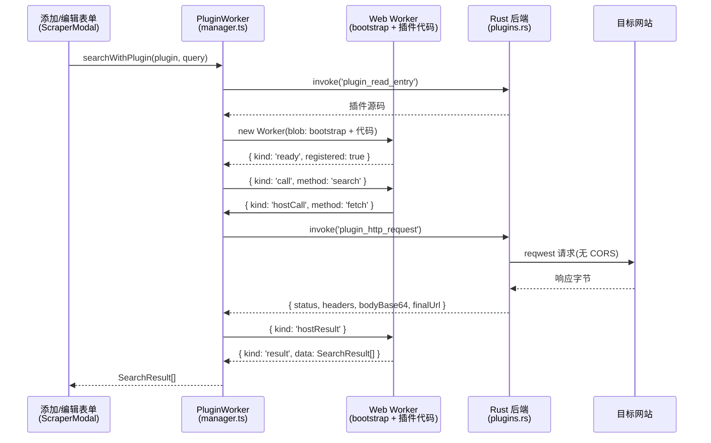

# 插件系统

ML-Maid 内建了一套通用插件系统。第一版(v1)支持一种插件类型 —— `metadata-scraper`(元数据刮削),它驱动表单内的"刮削"功能:在网站上搜索游戏、预览返回的元数据,并把勾选的字段(含封面/背景图)应用到添加/编辑表单。设计上为未来的其他插件类型预留了扩展空间。

官方插件存放在独立仓库([ML-Maid_Plugins](https://github.com/Kurosu-Ti01/ML-Maid_Plugins)),主程序不内置任何插件。如果你想**编写**插件,请阅读[插件开发指南](/zh/developer-guide/plugin-development/);本页介绍系统本身的设计。

## 设计目标

- **低开发门槛。** 插件就是一个文件夹:`manifest.json` + 一个 JavaScript 文件。不需要构建、不需要编译、不需要向主程序提 PR。放进 `plugins/` 目录点刷新即可生效。
- **任意网站皆可刮削。** 插件的 HTTP 流量经 Rust 后端代理转发,完全不受 CORS 限制。没有 JSON API 的网站、输出 Shift_JIS 老编码页面的网站都能支持。
- **受控执行。** 插件代码运行在 Web Worker 中:没有 DOM、没有 Node.js、不能加载外部脚本,能力仅限宿主注入的 API。
- **复用既有管线。** 下载的图片进入与手动选图相同的 `temp → 裁剪 → finalize` 流程;刮削字段合并进同一个表单模型。

## 插件形态

```
<数据目录>/plugins/            # dev:仓库根;安装版:文档\ML-Maid;便携版:exe 旁
└─ vndb-scraper/
   ├─ manifest.json            # id、name、version、type、apiVersion、entry 等
   └─ main.js                  # 入口脚本,在 Web Worker 中执行
```

manifest 的 `type` 与 `apiVersion` 是执行的闸门:未知类型或不兼容的 API 版本仍会显示在设置页,但被标记为"不支持"且永远不会执行。这就是向前兼容机制 —— 未来的 ML-Maid 可以引入 `type: "theme"` 或 `apiVersion: 2` 而不破坏旧安装。

## 运行时架构



### 插件发现(Rust,`plugins.rs`)

`plugins_list` 扫描 `plugins/` 的一级子目录并解析各自的 `manifest.json`。解析失败只会跳过那一个目录(stderr 记录日志),坏插件不会连累其他插件。`plugin_read_entry` 返回入口脚本文本;目录名与 manifest 的 `entry` 都要通过 `is_safe_name` 校验(不含分隔符、不含 `..`、不以 `.` 开头),防止路径穿越。

### Worker 沙箱(前端,`src/plugins/`)

`bootstrap.ts` 以源码字符串的形式保存 Worker 侧运行时。`buildWorkerSource()` 把它与插件代码、末尾的 ready 上报拼接为一个 `blob:` URL,并据此创建 Worker(CSP:`worker-src 'self' blob:`)。bootstrap 定义了插件的全部 API 面:

- `MLMaid.register({ search, getDetails })` —— 必须在顶层同步调用;末尾的 `__mlmaidReady()` 上报注册是否发生,未注册或崩溃的插件会被立即销毁。
- `host.fetch(url, options)` —— 通过消息传递桥接到后端代理(见下)。
- `host.log(...)` —— 单向日志,带 `[plugin:<id>]` 前缀。

`manager.ts` 用模块级 `Map` 管理 Worker 生命周期(绝不放进 Pinia —— 响应式代理不能包裹 Worker)。Worker 按插件 id 惰性创建并复用;禁用插件或刷新列表时销毁。两道超时保护宿主:初始化 5 秒、每次 `search`/`getDetails` 调用 60 秒。超时的 Worker 视为死循环并被 terminate —— `Worker.terminate()` 是终止失控 JavaScript 的唯一手段。

### RPC 协议

消息是以 `kind` 区分的联合类型,id 按发送方独立自增,两个方向永不冲突:

| kind | 方向 | 用途 |
| --- | --- | --- |
| `call` / `result` | 宿主 → Worker / Worker → 宿主 | 调用 `search`/`getDetails`,返回结果或错误 |
| `hostCall` / `hostResult` | Worker → 宿主 / 宿主 → Worker | `fetch`(请求/响应)与 `log`(无应答) |
| `ready` | Worker → 宿主 | 一次性:插件是否完成注册 |

### HTTP 代理(Rust,`plugin_http_request`)

共享的 `reqwest` 客户端(rustls、gzip、30 秒超时、`ML-Maid/<version>` UA)替插件执行 GET/POST/HEAD 请求。响应体**恒为 base64 编码**返回:大量老 VN 网站输出 Shift_JIS 或 EUC-JP,有损的 UTF-8 转换会毁掉日文内容。Worker 侧响应对象暴露 `bytes`、`text(encoding?)`(任意 `TextDecoder` 标签)与 `json()`,由插件自己决定解码方式。

防护措施:仅允许 `http`/`https`;拒绝 `localhost` 与环回/私网/链路本地 IP 字面量;响应体流式读取并在 10 MB 处截断(不信任 `Content-Length`)。这**并非**完整的 SSRF 加固(没有 DNS 重绑定防御)—— 插件是手动安装的,信任决策发生在安装时,代理只是拒绝明显不属于公网的目标。

### 图片下载(`download_game_image`)

刮削到的图片以 URL 形式到达,由宿主下载。该命令抓取字节(上限 30 MB),用**魔数嗅探**确定格式(`image::guess_format` —— 不信任响应头和 URL 扩展名,嗅探同时证明数据确实是图片),清理同名旧文件,写入 `temp/images/<uuid>/<type>.<ext>`。返回值与 `process_game_image` 同形,因此预览、裁剪、保存时 finalize、取消时清理等流程零改动复用。

刮削 UI 中的远程缩略图不经过 `img-src`:它们通过代理抓取后转为 `blob:` 对象 URL 渲染,现有 CSP 已放行。

### 启用状态

被禁用的插件 id 持久化在 `settings.conf` 的 `[plugins]` 节,形式为 `disabled[]=<id>`。存**禁用**列表意味着新插件开箱即用,删除插件也不会留下有意义的残留。设置页的插件卡片列出已安装插件(版本/类型标签、启用开关、刷新、打开目录)。

## 安全模型

| 层 | 约束 |
| --- | --- |
| Web Worker | 无 DOM、无 Tauri API、不能 `importScripts` 远程代码(blob worker 继承 CSP `script-src 'self'`) |
| 宿主 API | Worker 仅有 `host.fetch` 与 `host.log` 两个能力,其余全部经由类型化的刮削契约 |
| HTTP 代理 | 仅 http/https,拒绝私网/环回目标,10 MB 上限,仅 GET/POST/HEAD |
| 文件系统 | 插件接触不到任何路径;宿主读取入口脚本(防穿越校验),图片写入按游戏隔离的 temp 槽位且文件名走白名单 |
| 终止开关 | 每次调用 60 秒超时强制 terminate;禁用插件立即销毁其 Worker |

剩下的信任边界是有意为之:插件可以让代理抓取任何公网 URL。安装插件即信任其作者 —— 与 Obsidian、Playnite 的模型相同。安装第三方插件前请审阅其 `main.js`(它是未压缩的普通 JavaScript)。

## 文件索引

| 区域 | 文件 |
| --- | --- |
| 后端 | `src-tauri/src/plugins.rs`(命令:`plugins_list`、`plugin_read_entry`、`plugin_http_request`、`download_game_image`)、`paths.rs`(`plugins_path`)、`settings.rs`(`[plugins]` 节) |
| 宿主运行时 | `src/plugins/types.ts`、`bootstrap.ts`、`manager.ts`、`apply.ts` |
| 状态 | `src/stores/plugins.ts` |
| UI | `src/components/ScraperModal.vue`、`ImageUrlDialog.vue`、`Settings.vue` 的插件卡片、`GameAddForm.vue` / `GameEditForm.vue` 的刮削按钮 |
| 策略 | `index.html`(CSP `worker-src 'self' blob:`)、`src-tauri/capabilities/default.json`(opener 路径 scope) |
