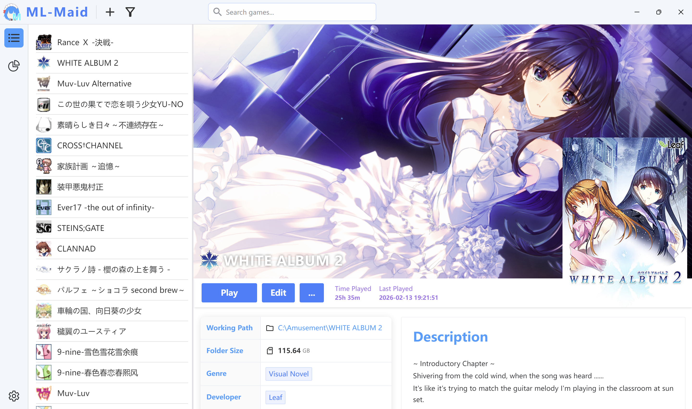
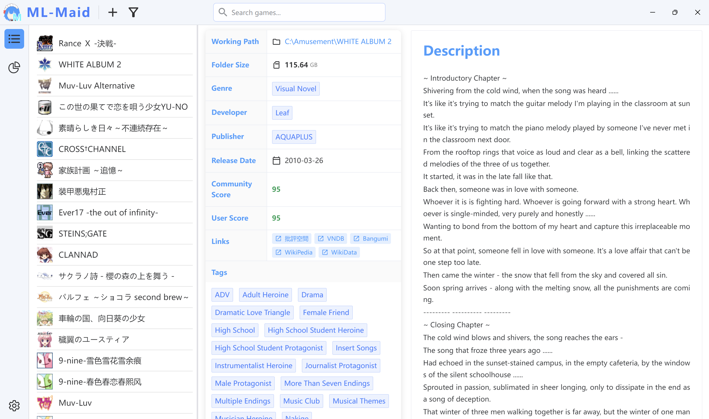
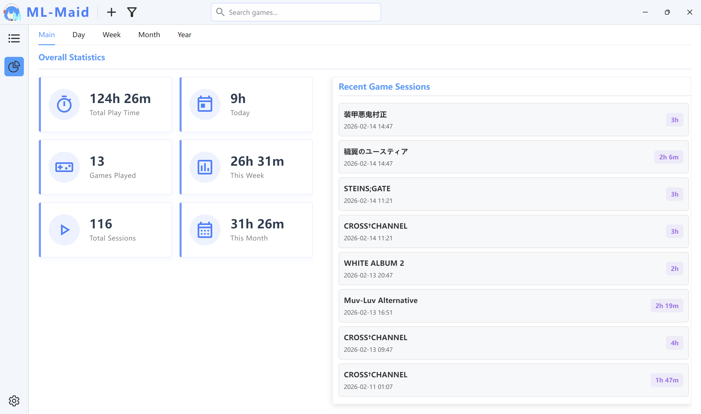
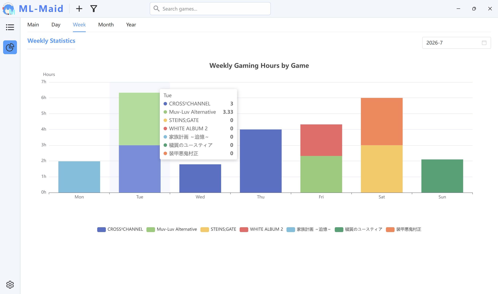
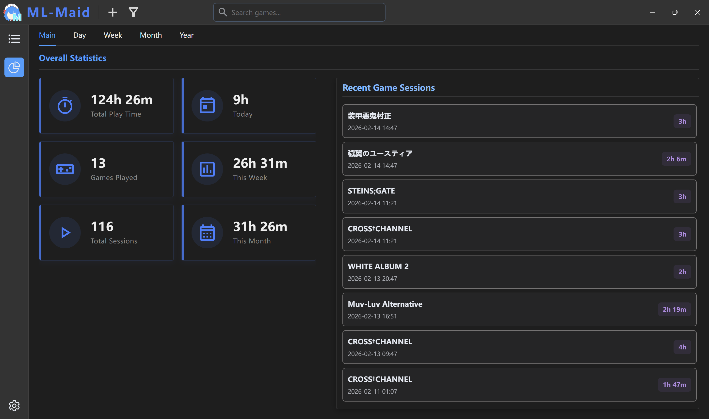
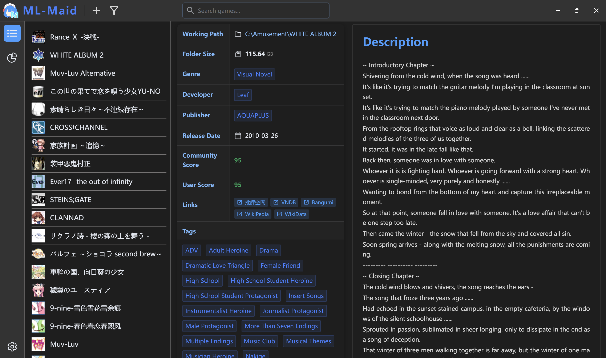
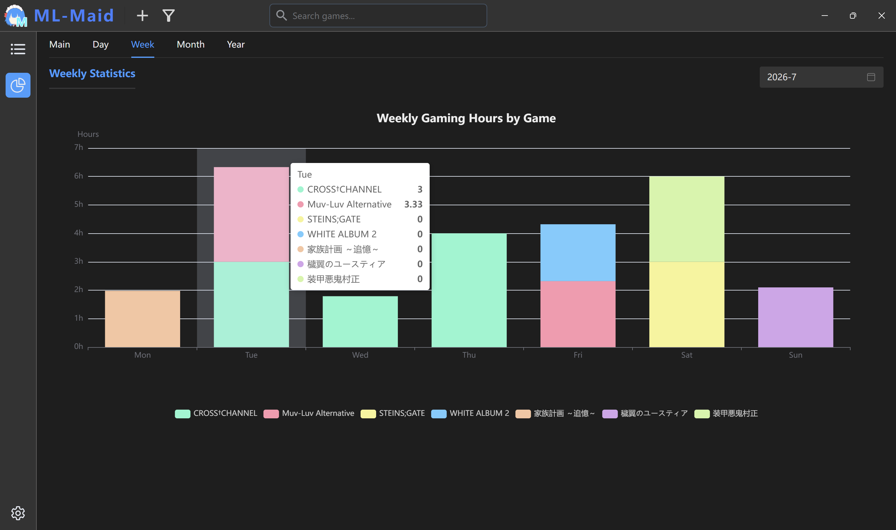

  

  <h1 align="center">
    ML-Maid
  </h1>

  

    
     
    
    
    
     
    
    
    
    
  

[English](README.md) | **简体中文**

一个简洁简单简略的视觉小说管理器（自用）。

## ✨ 功能特性

目前实现了一些基础的功能：

- **游戏库管理**：有基本的添加、编辑和删除游戏的功能，提供一个暂且以简明好看为目的的游戏信息页面。
- **游戏启动器**：直接从应用内启动游戏，并追踪游戏进程。也是基本功能。
- **游戏记录统计**：记录每次游戏进程时间，提供多种统计视图。或许有些鸡肋，但可以没用而不能没有。

## 📷 截图预览

  
Light

  
  
  
  

  
Dark

  
  
  
  

## 🌏 翻译

现在有官方支持的英语、简体中文，以及机翻的日语。欢迎提交 Pull Request 来完善翻译。